# **Skin Cancer Detection App**  

  

## **📌 About the Project**  
The **Skin Cancer Detection App** is an AI-powered mobile application that helps users detect skin cancer using machine learning. It also provides a **doctor-patient network and community**, allowing users to consult specialists and receive medical guidance.  

## **🚀 Features**  
✅ **AI-powered Skin Cancer Detection** – Upload an image, and the ML model predicts possible skin conditions.  
✅ **Doctor-Patient Network & Community** – Connect with specialists, discuss symptoms, and get medical advice.  
✅ **Video Consultation** – Users can have real-time video calls with doctors.  
✅ **AI-generated Prescription** – The app automatically summarizes the doctor’s advice and provides a prescription.  
✅ **Medicine Purchase Integration** – Directly order prescribed medicines from the app.  

## **🖼️ Screenshots**  
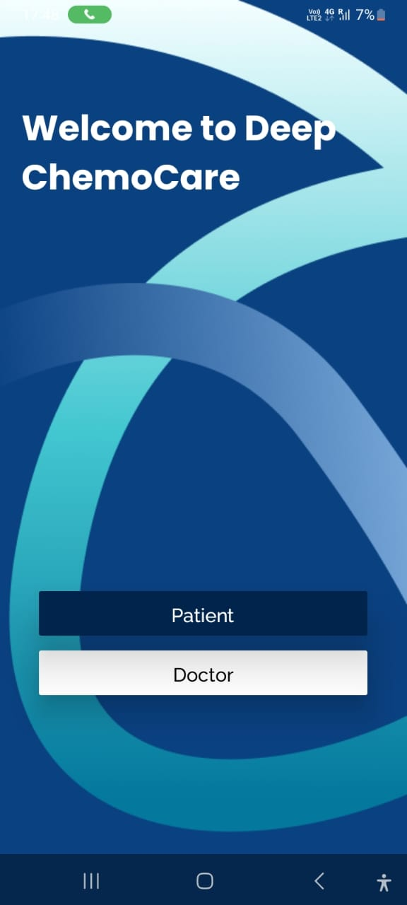  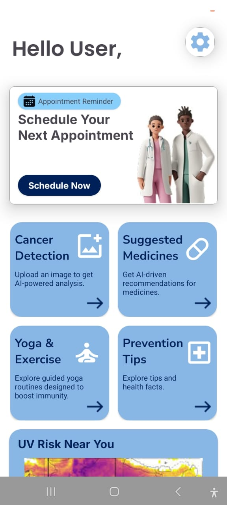 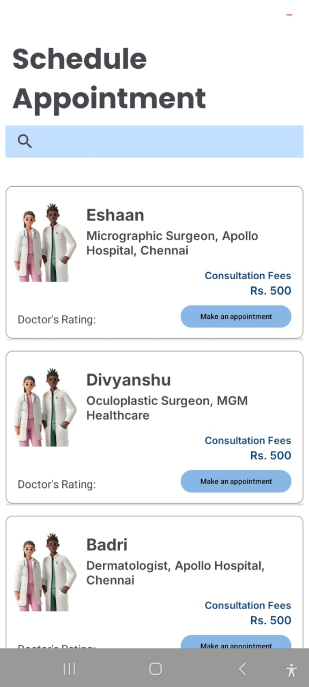 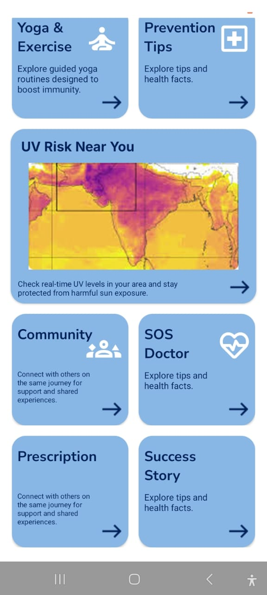 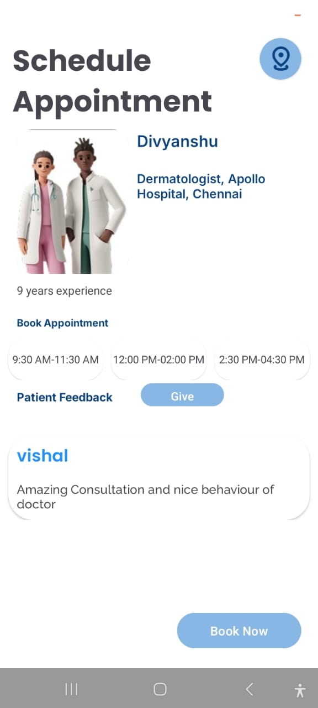 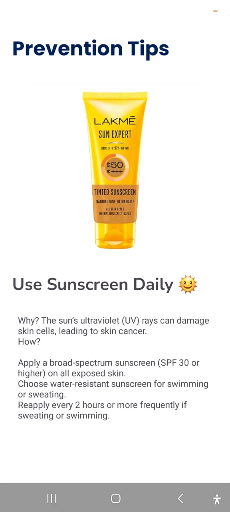 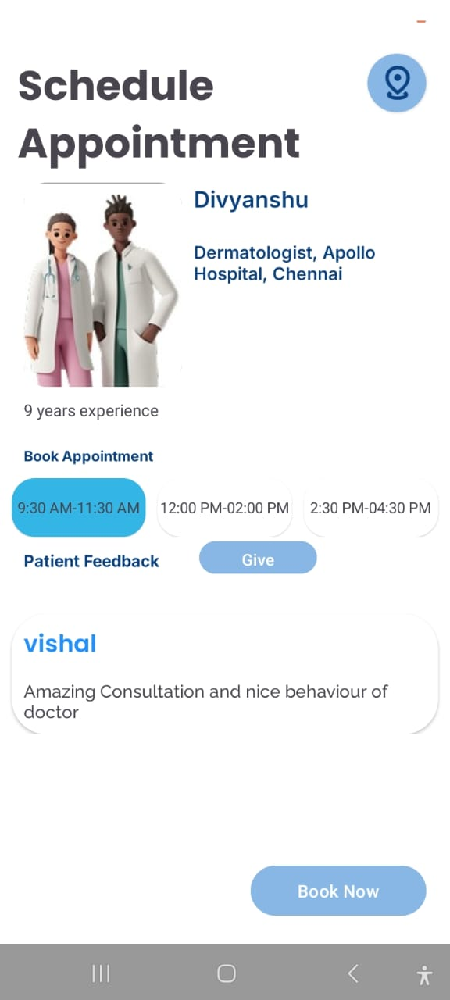 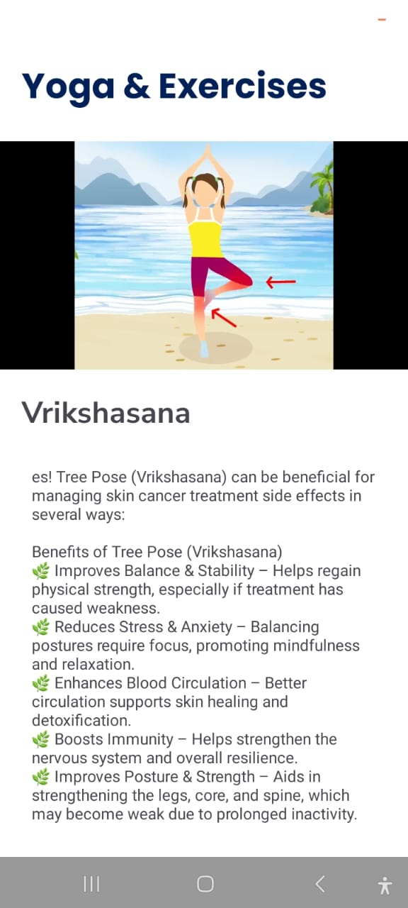 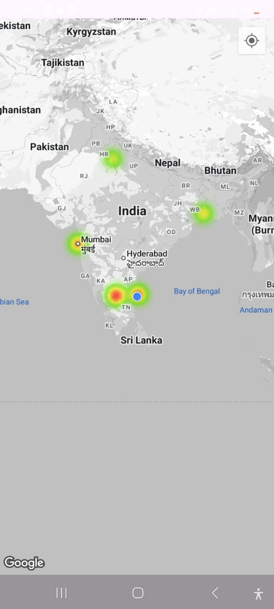 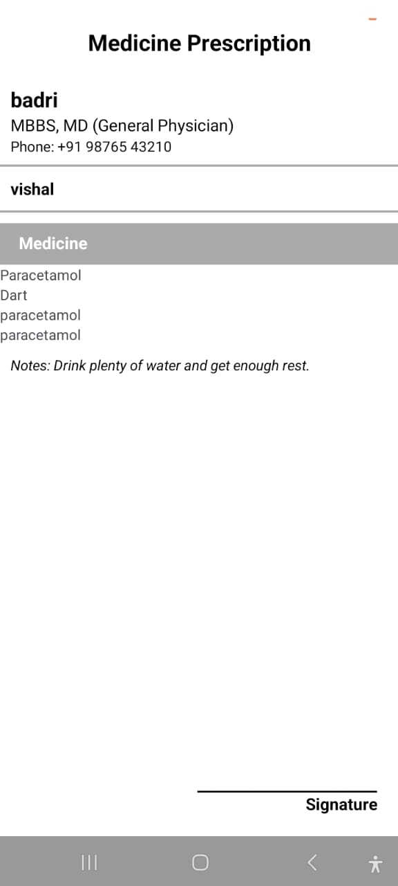 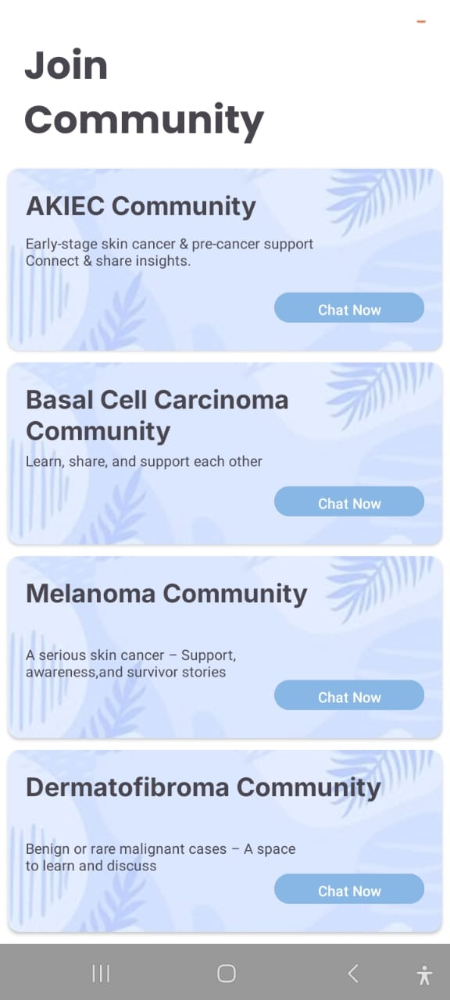   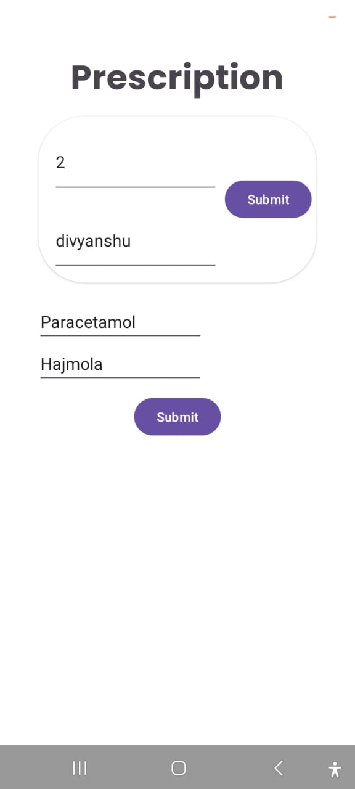 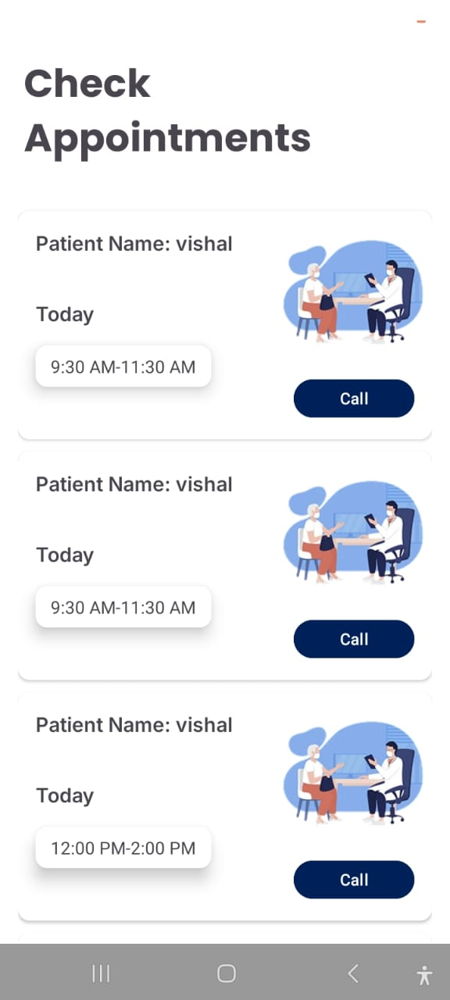  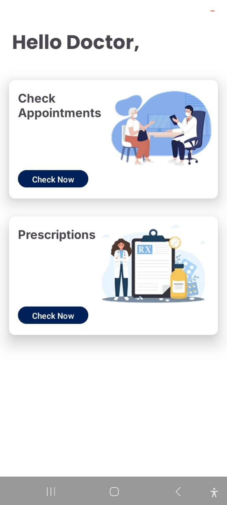 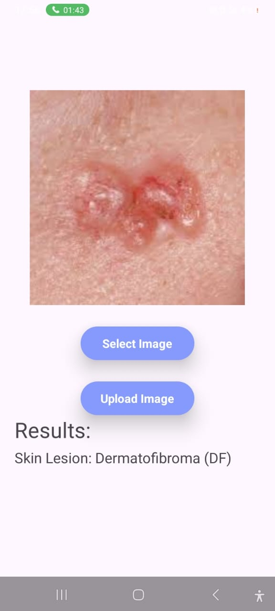 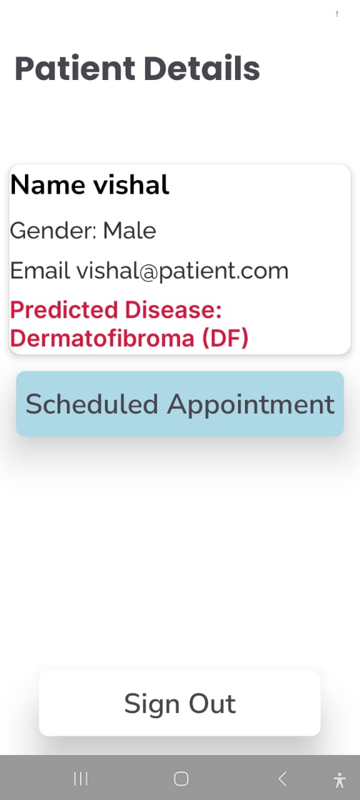 
## **🎥 Demo Video**  
[![Watch the Video]](https://youtube.com/shorts/d68mrveuKRQ?si=ZVhH-MpnUUL6f3OT)  
👉 **Click the thumbnail to watch the demo!**  

## **📲 Installation**  
1. Clone the repository:  
   ```bash
   git clone https://github.com/your-username/skin-cancer-detection-app.git
