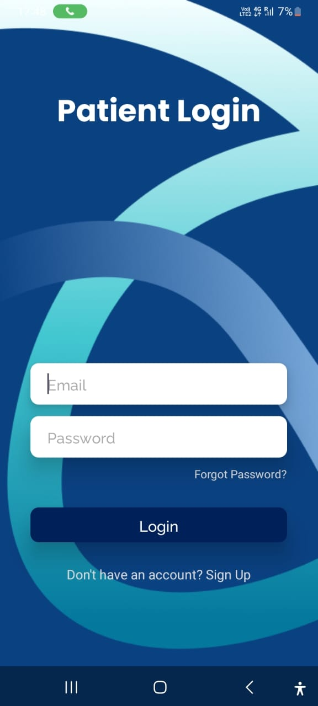
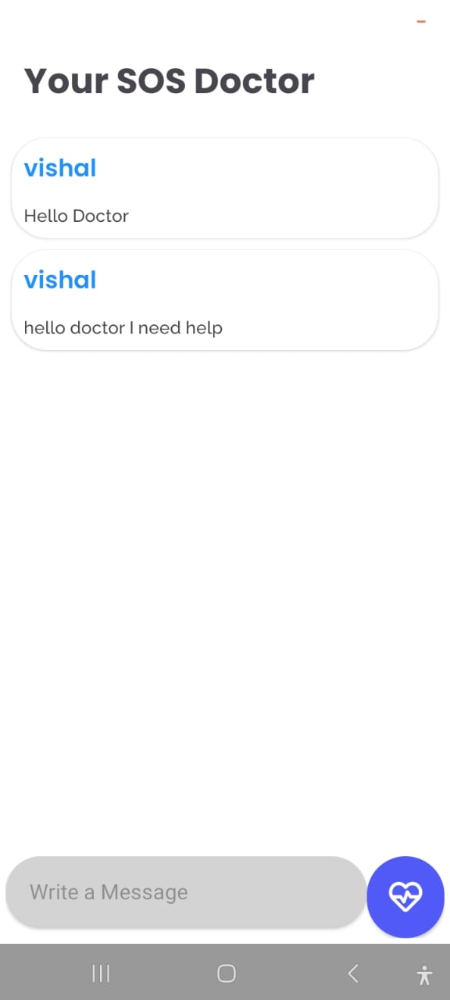

# DeepChemoCare

## 🚀 About the App
**DeepChemoCare** is a healthcare app that provides AI-powered **skin cancer detection**, **doctor-patient video consultations**, **prescription management**, and **blind assistance features**. It integrates **machine learning, computer vision, Firebase, WebRTC, and location tracking** to enhance patient care and medical assistance.

---


## **🖼️ Screenshots**  
                    
## **🎥 Demo Video**  
[![Watch the Video]](https://youtube.com/shorts/d68mrveuKRQ?si=ZVhH-MpnUUL6f3OT)  
👉 **Click the thumbnail to watch the demo!**  


## 📌 Features

### 🏥 **Doctor-Patient Video Consultation (WebRTC)**
- Live **video calls** between doctors and patients.
- Uses **WebRTC** for real-time communication.
- Secure **authentication for doctors** before initializing WebRTC.

---

### 🤖 **AI-Based Skin Cancer Detection**
- **Deep Learning model (.pth) hosted on Google Colab**.
- Android app **sends images to Colab API** and receives classification results.
- Supports detection of:
  - **AKIEC** - Actinic keratoses and intraepithelial carcinoma
  - **Basal** - Basal cell carcinoma
  - **VASC** - Vascular lesions
  - **DF** - Dermatofibroma
  - **MEL** - Melanoma
  - **NV** - Melanocytic nevi
  - **BKL** - Benign keratosis-like lesions

---

### 📜 **Prescription Management System**
- Doctors can **enter and store prescriptions** in **Firebase Realtime Database**.
- Patients can **view their prescriptions** securely.
- Supports **dynamic number of medicines** using an interactive UI.

---

### 🎥 **Motivation Videos & Mental Health Support**
- **Vertical Swipe View** for playing motivation videos.
- Uses **ExoPlayer** for **fullscreen video playback**.
- Seamless video experience for mental well-being support.

---

### 📅 **Smart Appointment Booking**
- Patients can **book doctor appointments**.
- Doctors can view their **upcoming appointments** stored in Firebase.

---

### 📍 **Patient Tracking & Location Features**
- Uses **FusedLocationProviderClient** and **Google Maps API**.
- **Real-time location tracking** of patients for emergency cases.
- **Geofencing alerts** for caretakers if a patient moves beyond a set boundary.

---

### 🦮 **AI-Powered Assistance for Blind Users**
- **Object and obstacle detection** using **Computer Vision**.
- **Voice-based navigation** with AI-powered voice assistant.
- **Emergency alerts** (Triple-tap power button sends location to police & volunteers).
- **Real-time navigation assistance with Google Maps**.

---

### ☀️ **UV Index Heat Map for Skin Protection**
- Uses **Tomorrow.io API** to fetch **UV Index data**.
- Generates a **heat map** to show areas with high UV exposure.
- Helps users **check UV levels** before going outdoors.

---

### 🍏 **Fruit Nutrition Information Feature**
- Users can **check different fruits & their health benefits**.
- **Swipe-based UI**:
  - **Top Half** → Fruit image.
  - **Bottom Half** → Detailed description of its benefits.
- Supports **gesture-based navigation**.

---

## 🛠️ **Technologies Used**
✅ **Android (Java & Kotlin)**  
✅ **Firebase Authentication & Realtime Database**  
✅ **Machine Learning & Deep Learning (PyTorch, Google Colab)**  
✅ **Computer Vision (OpenCV, TensorFlow Lite)**  
✅ **WebRTC (for Video Calling)**  
✅ **Google Maps & Location APIs**  
✅ **Tomorrow.io API (for UV Index Heat Map)**  
✅ **ExoPlayer (for Video Playback)**  

---

## 📥 **How to Install & Run**

### 🔧 Prerequisites
1. Android Studio (latest version)
2. Firebase Project setup
3. Google Colab API for ML model
4. WebRTC setup for video calls

### 🚀 Steps to Run
```bash
# Clone the repository
git clone https://github.com/divyanshujeekota/DeepChemoCare.git

# Open in Android Studio
cd deepchemocare

# Run the app on an emulator or physical device
```

---

## 📤 **How to Push Changes to GitHub**
```bash
# Initialize git
git init

git add .

git commit -m "Initial Commit"

git branch -M main

git remote add origin https://github.com/divyanshujeekota/DeepChemoCare.git

git push -u origin main
```

---

## 🤝 **Contributing**
Pull requests are welcome! If you'd like to contribute, please follow these steps:
1. Fork the repository.
2. Create a new branch (`git checkout -b feature-branch`).
3. Commit your changes (`git commit -m 'Add some feature'`).
4. Push to the branch (`git push origin feature-branch`).
5. Create a Pull Request.

---

## 📞 **Contact**
For any issues or suggestions, reach out to **[divyanshujeekota@gmail.com]**.

---

**🚀 Let's revolutionize healthcare with technology! 🚀**
